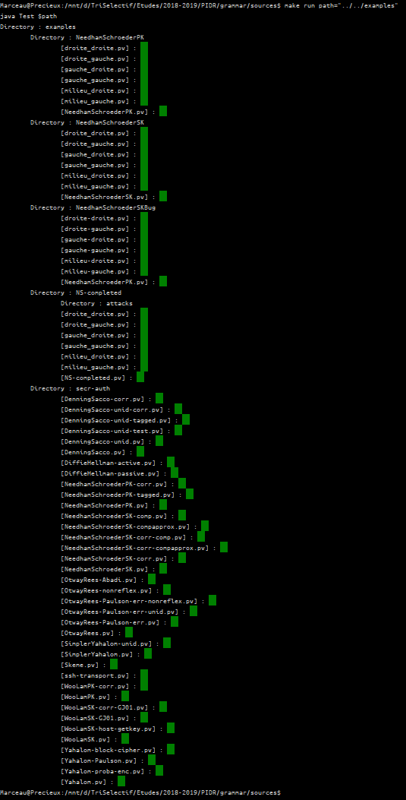
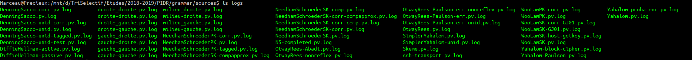
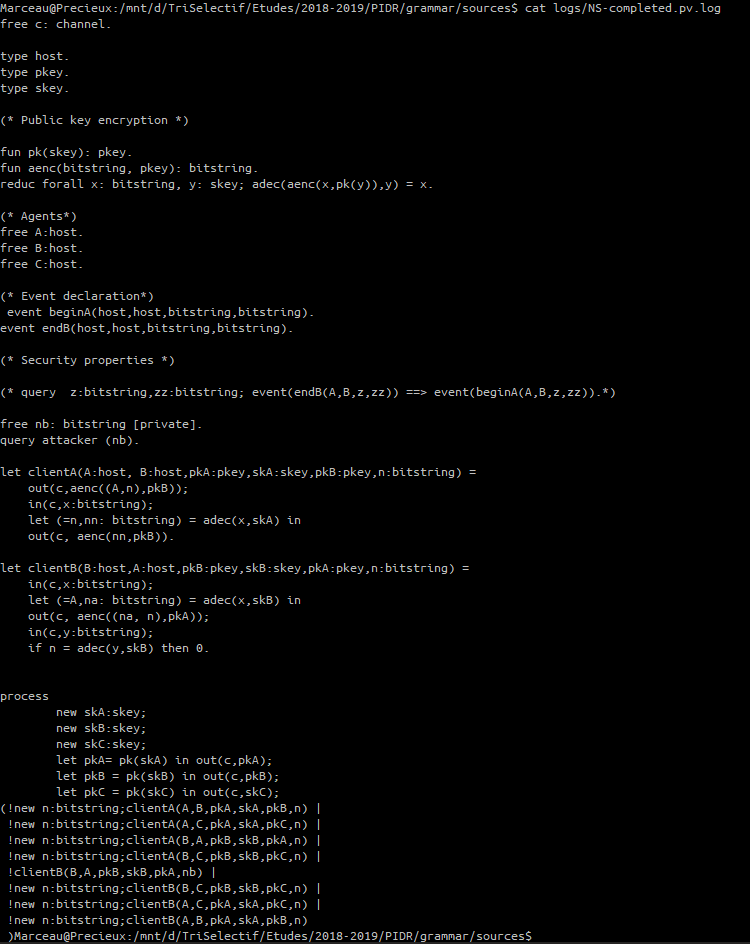
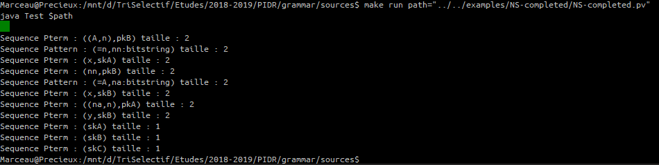

## Etat d'avancement

### Avancement au 26/03/2019
---

Après de multiples étapes et choix de stratégies, nous sommes en mesure de générer tous les fichiers fils correspondant à un fichier.

#### Fichiers générés

##### Nature des fichiers

La première étape consiste à concevoir toutes les combinaisons d'ensemble de parenthésage.

* D'une part, il est nécessaire de conserver la cohérence des échanges : des émissions / réceptions (par exemple si l'émission est parenthésée `(a,(b,c),d)`, le récepteur recevrait logiquement au même format ces données, il faut donc conserver cette cohérence).
* D'autre part, on peut très bien imaginer un échange `(a,(b,c))` au début du protocle, puis d'autres interlocuteurs qui échangent `((c,d),e)`.

Nous avons donc fait le choix d'adopter la même stratégie de parenthésage pour tous les tuples de même longueur.

_**Exemple :** un fichier qui contient 3 tuples de taille 3 et 10 tuples de taille 4 génèreront `(nombre de possibilités pour un tuple de taille 3) * (nombre de possibilités pour un tuple de taille 4)` _(1)_ ._

##### Génération de fichiers

Chaque fichier créé correspond à une combinaison d'ensemble de parenthésage, la politique de parenthésage étant la même pour chaque tuple de taille similaire (stratégie détaillée plus haut).

Nous avons donc longuement réfléchi sur l'algorithme et son implantation pratique en Java pour la génération de combinaison d'un tuple : pour une liste donnée, générer toutes les listes contenant les mêmes éléments dans le même ordre de telle sorte à ce que chaque liste ne contienne que 2 éléments.

_**Exemple :** un fichier qui ne contient que des tuples de taille 2 ne génère pas de fichier supplémentaire._

_**Exemple :** un fichier qui contient 1 tuple de taille 2, 1 tuple de taille 4, et 2 tuple de taille 5, génère 70 fichiers._

Les fichiers générés sont dans le dossier qui porte le nom du protocole, lui-même situé dans le dossier logs (qui est situé [ici](https://github.com/Amb02/PIDR/tree/master/grammar/sources), après compilation et exécution).

#### Implantation

Voici ci-dessous une brève synthèse de la manière dont nous procédons.

* Parsing du fichier original
    * Si un Tuple est recontré :
        * On crée un objet `Tuple tuple` contenant ce dernier
            * On génère en attribut de cet objet toutes les combinaisons possibles de ce dernier
        * On ajoute `tuple` à la liste `Tuples tuples`, la liste de tous les tuples du fichier.
        * On indique dans une HashMap que la ligne subit une modification en lui notifiant que `tuple` est lié à cette ligne
* On calcule le nombre de fichier à générer
* On boucle sur ce nombre de fichier. Pour un fichier n°i :
    * On crée le fichier n°i
    * On trouve alors le bon ensemble de combinaisons. Pour trouver la bonne combiaison pour chaque tuple à partir du numéro de fichier i, on procède comme un compteur à base différente pour chaque digit, où chaque digit représente une taille, et contient la k-ième combinaison pour les tuples de cette taille. A noter la cohérence avec la formule (i) qui correspond au maximum du compteur.
    _**Exemple :** un fichier qui contient 1 tuple de taille 2, 1 tuple de taille 4, et 2 tuple de taille 5, on a [0,0,0] qui contiendra la i-ème combinaison de chaque tuple indexé par sa taille. La 2ème case du tableau indique que tous les tuples de taille 4 subissent le 0-ième parenthésage. Le contenu de la 2ème case variera de 0 à 4._
        * On parcourt donc chaque tuple dont l'on stocke la combinaison pour ce fichier i
    * On remplit le fichier i en lisant le fichier original ligne par ligne
        * Si la ligne i doit subir une modification :
            * Pour chaque tuple lié à la ligne, on remplace celui-ci par la combinaison correspondant au fichier i
            * On imprime la nouvelle ligne
        * Sinon, on imprime la ligne lue

Plusieurs aspects peuvent sembler d'un premier abord pouvoir ne pas être optimaux (remplacement du tuple en temps réel, gestion des combinaisons, ...) mais l'implantation pratique nous a conduit à poser ces choix, dont la justification serait trop longue pour avoir sa place dans un aperçu qui se veut par nature succinct.
De plus, ceci est un pseudo-code simplifié et approximatif, il y a en réalité bien d'autres détails qui complexifient le travail.

#### Résultats

Les résultats sont positifs de manière certaine pour NS-Completed.pv, NeedhamSchroederPK.pv, certains fichiers tests, quant aux fichiers générés (au nombre de 10, ce qui est correct) pour NeedhamSchroederSK ils sont en cours de vérification mais sont également justes avec une probabilité supérieure à 90%, toutes les estimations de ces résultats étant sous réserve que nous ayions bien cerné les enjeux du problème étudié.

### Avancement au 11/03/2019
---

###### Analyseur lexical

* Nous avons terminé l'analyseur simple du langage après avoir bataillé avec ANTLR, nous avons dû changer de version et passer à la version 4 (pour voir comment mettre en place l'environnement d'ANTLR vous pouvez vous rendre [ici](../grammar/sources)).

* Nous avons testé notre analyseur sur tous les fichiers de tests en notre possession (une pastille verte signifie que le fichier est correctement parsé) :

* Nous avons aussi réussi à créer une copie au moment de l'analyse. Les copies sont stockées pour le moment dans le dossier logs :

Ci-dessous, un exemple avec le fichier NS-completed.pv.log :

* Nous avons réussi à extraire les règles de séquence qui nous intéressent pour la suite de notre travail. Ci-dessous, un exemple avec le fichier NS-completed.pv :

* Problèmes :

On voit bien avec l'exemple ci-dessus que les règles ne concernent pas uniquement les séquences qui nous intéressent. Il nous faut donc un moyen de trier parmi ces résultats ceux que l'on doit modifier ou non.

###### Analyse de trace

* L'analyse de la trace a été pour nous plus difficile, nous avons toujours du mal à comprendre. Evidemment nous arrivons, en nous basant sur le protocole, à retrouver certaines choses dans la globalité. Mais dès qu'il s'agit de regarder dans le détail, alors nous sommes très rapidement perdus avec des détails qui nous bloquent.

  Ci-dessous, une liste desdits problèmes :
  * in copy a_x (à la fin de la plupart des lignes)
  * les noms des variables qui apparaissent parfois pour ne plus jamais apparaître, et pour d'autres qui arrivent sans avoir été définis
  * les appels aux fonctions event
  * l'intérêt exact des fonctions sign, get keys, insert keys
  * les fonctions in (nous avons du mal à comprendre quelle machine recoit bel et bien le message dans la fonction in)

### Avancement au 26/02/2019
---

###### Modification des fichiers d'exemples

* Nous avons revu les tests de manière à cette fois avoir 6 cas.
  * Ainsi, pour NeedhamSchroeder, si nous avons (a,b) et l'élément c à rajouter, on a ((c,a),b) (c,(a,b)) ((a,c),b) (a,(c,b)) ((a,b),c) (a,(b,c)). Nous avons revu les fichiers pour NeedhamSchroederSK.pv.
  * Ne trouvant (étonnemment) pas d'attaque, nous avons fait de même pour NeedhamSchroederPK.pv, où là encore le résultat est surprenant mais à l'inverse puisque l'attaque subsiste dans tous les cas.
  * Les résultats de ces modifications se trouvent respectivement dans [ce dossier](../examples/NeedhamSchroederSK) ainsi que [celui-ci](../examples/NeedhamSchroederPK). Nous avons aussi répertorié dans un fichier README.md les résultats de l'exécution de ProVerif sur chacun des fichiers.

* Problèmes rencontrés :
  * Invariation des résultats en fonction des parenthésages pour ces fichiers alors que c'est censé influer dans le cas de NeedhamSchroeder.

###### Analyseur lexical

* Nous avons repris la grammaire modifée du langage, que nous avons écrite dans [AntlrWorks](https://www.antlr3.org/works/), afin d'exploiter [ANTLR](https://doc.lagout.org/programmation/Pragmatic%20Programmers/The%20Definitive%20ANTLR%20Reference.pdf). Après la résolution de quelques problèmes (récursivité, cycles, ...) nous obtenons une première version d'un parseur. Nous devons encore affiner nos tests car nous n'avons pas eu le temps de vérifier le bon fonctionnement du parseur sur une batterie de tests suffisemment importante.

### Avancement au 11/02/2019
---

###### Modification des fichiers d'exemples

* Nous avons pris et modifié les deux fichiers NS-completed.pv et NeedhamSchroederSK.pv.
Les résultats de ces modifications se trouvent respectivement dans [ce dossier](../examples/NS-completed) ainsi que [celui-ci](../examples/NeedhamSchroeder). Nous avons aussi répertorié dans un fichier README.md les résultats de l'exécution de ProVerif sur chacun des fichiers.

* Problèmes rencontrés :
  * Nous avons eu du mal à lire et surtout comprendre la trace d'attaque engendrée sur les fichiers notamment [ici](../examples/NS-completed/attacks)

###### Analyseur lexical

* Nous avons repris la grammaire modifée du langage, et tenté de refléchir à la méthode la plus efficace de mettre en place cet analyseur. En nous basant sur les connaissances que nous avons acquises l'année passée, nous avons commencé par lister pour chacune des règles les symboles directeurs, permettant, à la lecture d'un token, de connaître la règle à traiter.

* Nous nous basons sur l'algorithme suivant pour notre analyseur :

* Problèmes rencontrés :
  * Nous nous demandons s'il est possible de nous y prendre autrement. Nous avons connaissance d'un outil, ANTLR, qui permet de générer automatiquement un analyseur lexical à partir d'une grammaire. L'avantage de ce programme est qu'il est capable de gérer une analyse tant ascendante que descendante et sur des grammaires de tous types, contrairement à l'analyseur que l'on se propose de construire qui ne fonctionnerait que sur des grammaires LL(1) et en analyse descendante. Or, nous n'avons pas d'informations sur les caractéristiques de la grammaire de ProVerif.
