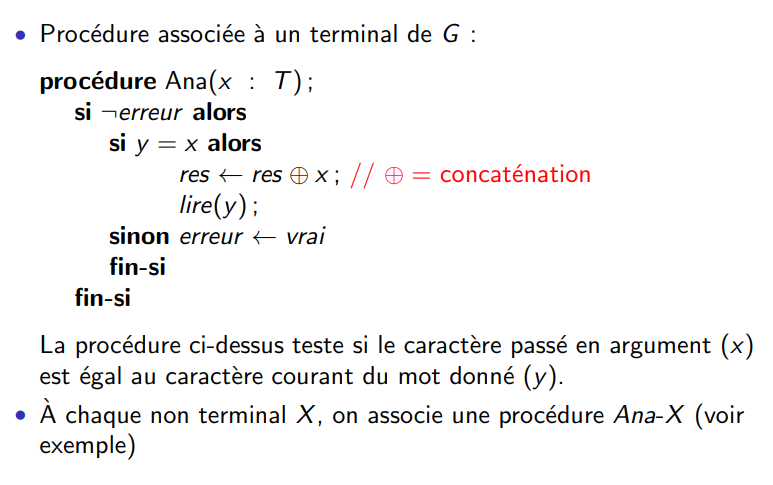

## Etat d'avancement

##### Avancement au 11/02/2019
---

###### Modification des fichiers d'exemples

* Nous avons pris et modifié les deux fichiers NS-completed.pv et NeedhamSchroederSK.pv.
Les résultats de ces modifications se trouvent respectivement dans [ce dossier](../examples/NS-completed) ainsi que [celui-ci](../examples/NeedhamSchroeder). Nous avons aussi répertorié dans un fichier README.md les résultats de l'exécution de ProVerif sur chacun des fichiers.

* Problèmes rencontrés :
  * Nous avons eu du mal à lire et surtout comprendre la trace d'attaque engendrée sur les fichiers notamment [ici](../examples/NS-completed/attacks)

###### Analyseur lexical

* Nous avons repris la grammaire modifée du langage, et tenté de refléchir à la méthode la plus efficace de mettre en place cet analyseur. En nous basant sur les connaissances que nous avons acquises l'année passée, nous avons commencé par lister pour chacune des règles les symboles directeurs, permettant, à la lecture d'un token, de connaître la règle à traiter.

* Nous nous basons sur l'algorithme suivant pour notre analyseur :

* Problèmes rencontrés :
  * Nous nous demandons s'il est possible de nous y prendre autrement. Nous avons connaissance d'un outil, ANTLR, qui permet de générer automatiquement un analyseur lexical à partir d'une grammaire. L'avantage de ce programme est qu'il est capable de gérer une analyse tant ascendante que descendante et sur des grammaires de tous types, contrairement à l'analyseur que l'on se propose de construire qui ne fonctionnerait que sur des grammaires LL(1) et en analyse descendante. Or, nous n'avons pas d'informations sur les caractéristiques de la grammaire de ProVerif.
